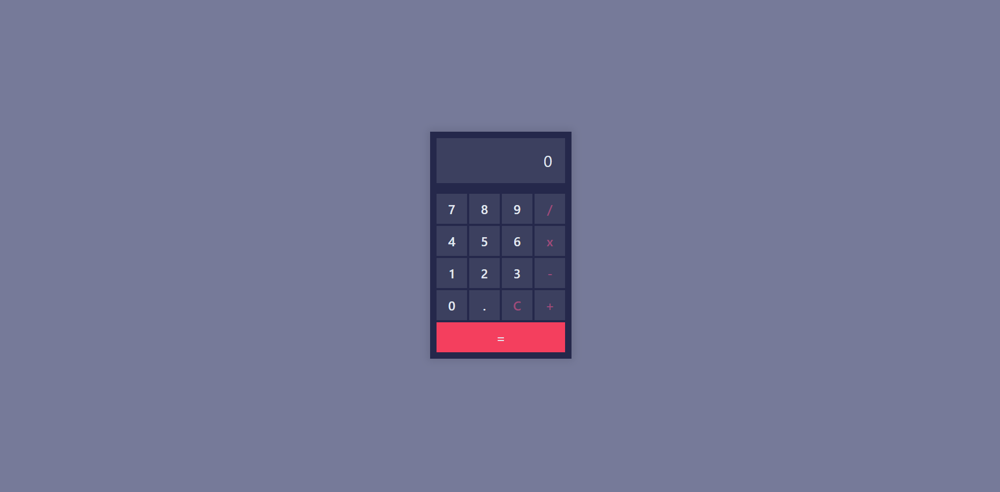

# 🧮 Calculadora Básica

Uma calculadora simples feita com HTML, CSS e JavaScript puro. Ideal para realizar operações matemáticas básicas como adição, subtração, multiplicação e divisão, com uma interface limpa e intuitiva.

🔗 **Acesse o projeto online:** [GitHub Pages](https://endriusssantos.github.io/calculadora-basica/)

---

## ✨ Funcionalidades

- ➕ Operações Básicas: Adição, subtração, multiplicação e divisão.
- 🧠 Lógica de Expressão: Avaliação dinâmica da expressão digitada.
- 🧽 Limpar Display: Botão de “C” para apagar todos os dados inseridos.
- 📱 Responsivo: Compatível com dispositivos móveis e desktops.
- 🎨 Visual Clean: Interface simples e moderna com boa legibilidade.

---

## 🛠️ Tecnologias Utilizadas

- **HTML5**
- **CSS3**
  - Flexbox para o layout dos botões
  - Estilização moderna do display e teclado
- **JavaScript (Vanilla)**
  - Manipulação de DOM
  - Avaliação de expressões
  - Tratamento de erros e interações

---

## 📂 Estrutura de Pastas

```
calculadora-basica/
├── index.html
└── src/
    └── js/
        └── index.js
```

---

## 🚀 Como Rodar o Projeto

1. Clone o repositório:

```bash
git clone https://github.com/endriusssantos/calculadora-basica
cd calculadora-basica
```

2. Abra o arquivo index.html em seu navegador, ou use uma extensão como "Live Server" no VSCode.

---

## 💡 Possíveis Melhorias Futuras

- ⌨️ Suporte completo ao teclado
- 🧾 Histórico de cálculos
- 🎵 Efeitos sonoros ao clicar

---

## 📸 Preview



---

## 🧑‍💻 Autor

Feito com 💙 por Endrius da Silva dos Santos
